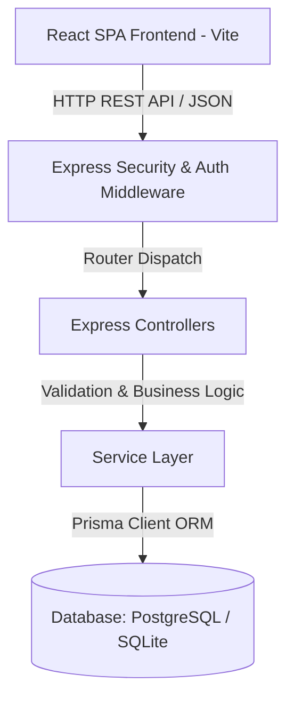
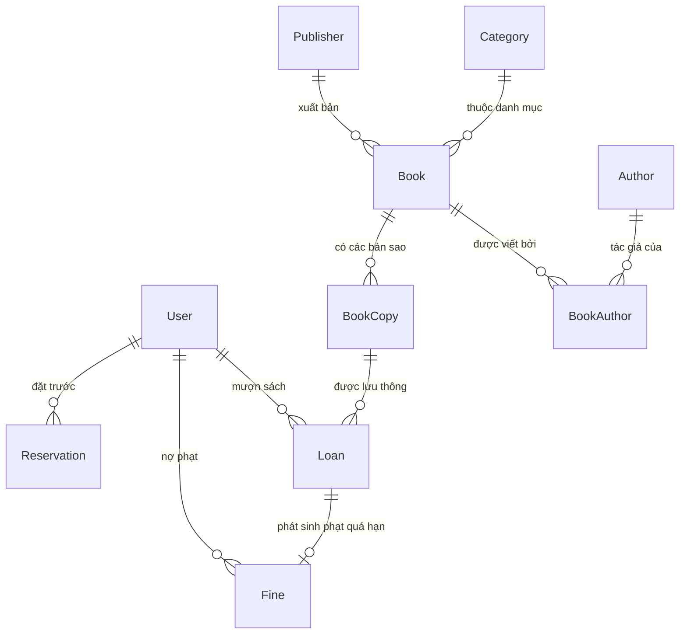

# 📚 LibraryOS — Hệ Thống Quản Lý Thư Viện Modern Full-Stack

LibraryOS là hệ thống quản lý thư viện hiện đại, toàn diện được phát triển theo kiến trúc RESTful API kết hợp Single Page Application (SPA). Hệ thống hỗ trợ đa vai trò người dùng (SuperAdmin, Admin, Thủ thư, Độc giả), quy trình lưu thông mượn/trả sách tự động, xử lý vi phạm phạt quá hạn, đặt giữ chỗ sách và hệ thống báo cáo thống kê trực quan.

---

## 📋 Mục Lục

1. [Sơ Đồ Kiến Trúc & Cơ Sở Dữ Liệu](#-sơ-đồ-kiến-trúc--cơ-sở-dữ-liệu)
2. [Công Nghệ Sử Dụng (Tech Stack)](#-công-nghệ-sử-dụng-tech-stack)
3. [Sơ Đồ Phân Quyền Hệ Thống (RBAC Matrix)](#-sơ-đồ-phân-quyền-hệ-thống-rbac-matrix)
4. [Cấu Trúc Thư Mục Dự Án](#-cấu-trúc-thư-mục-dự-án)
5. [Phân Tích 5 Use Case Trọng Tâm](#-phân-tích-5-use-case-trọng-tâm)
6. [Hướng Dẫn Cài Đặt & Khởi Chạy](#-hướng-dẫn-cài-đặt--khởi-chạy)
7. [Tài Khoản Thử Nghiệm Mặc Định](#-tài-khoản-thử-nghiệm-mặc-định)

---

## 🏛️ Sơ Đồ Kiến Trúc & Cơ Sở Dữ Liệu

### 1. Kiến Trúc Hệ Thống (System Architecture)


### 2. Sơ Đồ Quan Hệ Thực Thể (ERD - Entity Relationship Diagram)


---

## 🛠️ Công Nghệ Sử Dụng (Tech Stack)

### **Frontend**
- **Framework**: React 18 + Vite + TypeScript
- **Styling**: Vanilla CSS custom design system + TailwindCSS utilities
- **Icons**: Lucide React icons
- **State & Context**: React Context API (`AuthContext`, `ToastContext`)

### **Backend**
- **Runtime & Server**: Node.js (v20+) + Express.js
- **ORM & Database**: Prisma ORM + SQLite / PostgreSQL
- **Security & Validation**: JWT (JSON Web Tokens), Bcrypt password hashing, Zod schema validation
- **Documentation**: Swagger UI (`/api-docs`)

---

## 🛡️ Sơ Đồ Phân Quyền Hệ Thống (RBAC Matrix)

Hệ thống được thiết kế theo mô hình **Role-Based Access Control (RBAC)** với 4 cấp bậc phân quyền rõ ràng:

| Tính Năng / Quyền Hạn | MEMBER (Bạn Đọc) | LIBRARIAN (Thủ Thư) | ADMIN (Quản Trị Viên) | SUPERADMIN (Quản Trị Cấp Cao) |
|---|:---:|:---:|:---:|:---:|
| Xem danh mục sách & Tra cứu | ✅ | ✅ | ✅ | ✅ |
| Đặt giữ chỗ sách (Reservation) | ✅ | ✅ | ✅ | ✅ |
| Quản lý mượn / trả / gia hạn sách | ❌ | ✅ | ✅ | ✅ |
| Quản lý danh mục & Thông tin sách | ❌ | ✅ | ✅ | ✅ |
| Thu tiền phạt quá hạn (Fines) | ❌ | ✅ | ✅ | ✅ |
| Quản lý tài khoản Bạn đọc & Thủ thư | ❌ | ❌ | ✅ | ✅ |
| Quản lý tài khoản Admin & Toàn hệ thống | ❌ | ❌ | ❌ | ✅ |

---

## 📁 Cấu Trúc Thư Mục Dự Án

```
library-app/
├── docs/
│   └── use-cases/                           # Tài liệu chi tiết 5 Use Case (Vị trí code, DB Tables, SQL)
│       ├── UC01_Auth_And_User_Management.md
│       ├── UC02_Book_Catalog_Management.md
│       ├── UC03_Borrow_And_Return_Circulation.md
│       ├── UC04_Fines_And_Penalty_Management.md
│       └── UC05_Book_Reservation_System.md
├── prisma/
│   ├── schema.prisma                        # Prisma Database Schema
│   └── seed.ts                              # Dữ liệu khởi tạo hệ thống
├── src/
│   ├── api/                                 # Frontend API client
│   ├── components/                          # React UI Components
│   │   ├── AuthModal.tsx                    # Modal Đăng nhập / Đăng ký
│   │   ├── BookDetailModal.tsx              # Chi tiết cuốn sách
│   │   ├── CatalogBrowse.tsx                # Tra cứu sách
│   │   ├── CirculationDesk.tsx              # Quầy mượn / trả sách
│   │   ├── FinesView.tsx                    # Quản lý phạt
│   │   ├── LibraryHome.tsx                  # Trang chủ thư viện
│   │   ├── Navbar.tsx                       # Thanh điều hướng
│   │   ├── ReportsDashboard.tsx             # Thống kê báo cáo
│   │   ├── ReservationsView.tsx             # Quản lý đặt trước
│   │   └── UserManagement.tsx               # Quản lý người dùng
│   ├── context/                             # React Context Providers
│   ├── middleware/                          # Express Middlewares (Auth, Error)
│   ├── modules/                             # Backend Modules (Controller, Service, Routes)
│   │   ├── auth/
│   │   ├── catalog/
│   │   ├── circulation/
│   │   ├── fine/
│   │   ├── report/
│   │   ├── reservation/
│   │   └── user/
│   ├── App.tsx                              # Main App Shell
│   └── server.ts                            # Express Server Entrypoint
├── package.json
└── README.md                                # Tài liệu tổng quan dự án
```

---

## 🎯 Phân Tích 5 Use Case Trọng Tâm

Hệ thống được thiết kế dựa trên 5 Use Case cốt lõi điều hành toàn bộ hoạt động thư viện. Mỗi Use Case được trình bày chi tiết trong tài liệu `.md` tương ứng với vị trí mã nguồn và câu lệnh SQL chuẩn:

### 1. [UC-01: Đăng Ký, Đăng Nhập & Quản Lý Người Dùng](file:///Users/admin/library-app/docs/use-cases/UC01_Auth_And_User_Management.md)
- **Bảng DB Sử Dụng**: `users`, `refresh_tokens`.
- **Mã Nguồn Chi Tiết**: [user.service.ts:L50-105](file:///Users/admin/library-app/src/modules/user/user.service.ts#L50-L105), [UserManagement.tsx:L31-115](file:///Users/admin/library-app/src/components/UserManagement.tsx#L31-L115).
- **Tóm tắt**: Quản lý vòng đời tài khoản người dùng, xác thực JWT bảo mật, phân quyền 4 cấp bậc (SuperAdmin, Admin, Thủ thư, Độc giả).

### 2. [UC-02: Tra Cứu, Tìm Kiếm & Quản Lý Danh Mục Sách](file:///Users/admin/library-app/docs/use-cases/UC02_Book_Catalog_Management.md)
- **Bảng DB Sử Dụng**: `books`, `categories`, `publishers`, `authors`, `book_authors`, `book_copies`.
- **Mã Nguồn Chi Tiết**: [book.service.ts:L7-105](file:///Users/admin/library-app/src/modules/catalog/book.service.ts#L7-L105), [CatalogBrowse.tsx:L25-130](file:///Users/admin/library-app/src/components/CatalogBrowse.tsx#L25-L130).
- **Tóm tắt**: Cung cấp bộ lọc tìm kiếm sách đa tiêu chí (tên sách, tác giả, ISBN, thể loại) cho Độc giả và công cụ CRUD sách cho Thủ thư.

### 3. [UC-03: Quản Lý Quy Trình Mượn - Trả & Gia Hạn Sách](file:///Users/admin/library-app/docs/use-cases/UC03_Borrow_And_Return_Circulation.md)
- **Bảng DB Sử Dụng**: `loans`, `book_copies`, `users`, `fines`.
- **Mã Nguồn Chi Tiết**: [loan.service.ts:L25-105](file:///Users/admin/library-app/src/modules/circulation/loan.service.ts#L25-L105), [CirculationDesk.tsx:L35-160](file:///Users/admin/library-app/src/components/CirculationDesk.tsx#L35-L160).
- **Tóm tắt**: Xử lý phiếu mượn sách tại Quầy lưu thông (Circulation Desk), gia hạn thời gian mượn và ghi nhận trả sách.

### 4. [UC-04: Xử Lý Vi Phạm & Quản Lý Phạt Quá Hạn](file:///Users/admin/library-app/docs/use-cases/UC04_Fines_And_Penalty_Management.md)
- **Bảng DB Sử Dụng**: `fines`, `loans`, `users`.
- **Mã Nguồn Chi Tiết**: [fine.service.ts:L6-86](file:///Users/admin/library-app/src/modules/fine/fine.service.ts#L6-L86), [FinesView.tsx:L25-110](file:///Users/admin/library-app/src/components/FinesView.tsx#L25-L110).
- **Tóm tắt**: Theo dõi khoản nợ phạt do trả quá hạn hoặc hỏng/mất sách, thu tiền phạt và tự động mở khóa tài khoản khi hoàn tất thanh toán.

### 5. [UC-05: Đặt Trước Sách & Thống Kê Báo Cáo Thư Viện](file:///Users/admin/library-app/docs/use-cases/UC05_Book_Reservation_System.md)
- **Bảng DB Sử Dụng**: `reservations`, `books`, `loans`, `fines`, `users`.
- **Mã Nguồn Chi Tiết**: [report.service.ts:L10-85](file:///Users/admin/library-app/src/modules/report/report.service.ts#L10-L85), [ReportsDashboard.tsx:L20-140](file:///Users/admin/library-app/src/components/ReportsDashboard.tsx#L20-L140).
- **Tóm tắt**: Hàng chờ đặt giữ chỗ sách hết bản sao và Dashboard trực quan hóa dữ liệu mượn trả, doanh thu tiền phạt, top sách hot.

---

## 🚀 Hướng Dẫn Cài Đặt & Khởi Chạy

### 1. Yêu cầu hệ thống
- Node.js >= 18.x
- npm >= 9.x

### 2. Cài đặt Dependencies
```bash
cd library-app
npm install
```

### 3. Khởi tạo Cơ sở dữ liệu & Seed Data
```bash
npx prisma db push
npx tsx prisma/seed.ts
```

### 4. Khởi chạy Server Development (Vite + Backend)
```bash
npm run dev
```
- **Ứng dụng Web (Frontend)**: `http://localhost:3000`
- **Swagger API Docs**: `http://localhost:3000/api-docs`

---

## 🔑 Tài Khoản Thử Nghiệm Mặc Định

| Vai Trò | Email | Mật Khẩu |
|---|---|---|
| **SUPERADMIN** | `superadmin@library.com` | `SuperAdmin123!` |
| **ADMIN** | `admin@library.com` | `Admin123!` |
| **LIBRARIAN** | `librarian1@library.com` | `Librarian123!` |
| **MEMBER** | `member1@library.com` | `Member123!` |
