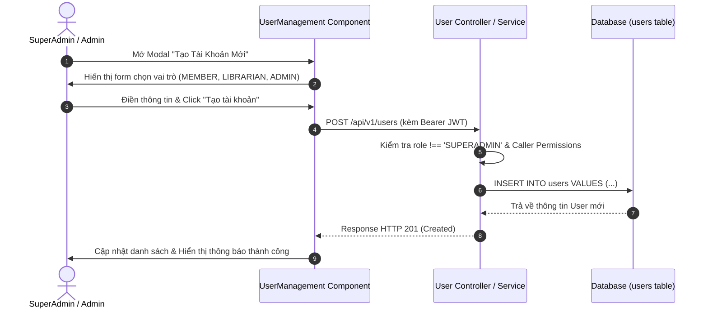

# UC-01: Đăng Ký, Đăng Nhập & Quản Lý Người Dùng (Authentication & User Management)

## 1. Tổng Quan Use Case
- **Mã Use Case**: UC-01
- **Tên Use Case**: Đăng Ký, Đăng Nhập & Quản Lý Người Dùng
- **Mô tả ngắn**: Cung cấp cơ chế xác thực an toàn (JWT), đăng ký tài khoản cho Độc giả, và giao diện quản lý người dùng theo cấp quyền (SuperAdmin, Admin, Thủ thư).
- **Tác nhân chính (Actors)**: 
  - **MEMBER (Độc giả)**: Đăng ký, đăng nhập, quản lý thông tin cá nhân.
  - **ADMIN (Quản trị viên)**: Tạo và quản lý tài khoản Thủ thư, Độc giả; thay đổi trạng thái tài khoản (Active, Suspended, Inactive).
  - **SUPERADMIN (Quản trị viên Cấp cao)**: Toàn quyền quản lý hệ thống, quản lý tài khoản Admin, Thủ thư và Độc giả.

---

## 2. Các Bảng Cơ Sở Dữ Liệu Sử Dụng (Database Tables Used)

| Tên Bảng (Database Table) | Vai Trò Trong Use Case |
|---|---|
| `users` | Lưu trữ thông tin tài khoản, mật khẩu mã hóa (`password_hash`), vai trò (`role`) và trạng thái (`status`). |
| `refresh_tokens` | Lưu trữ Refresh Token JWT để gia hạn phiên đăng nhập an toàn. |

---

## 3. Vị Trí Mã Nguồn Chi Tiết (Source Code Line Ranges)

### Backend Logic
- **[jwt.util.ts](file:///Users/admin/library-app/src/modules/auth/jwt.util.ts#L6-L45)**: Định nghĩa payload `AuthUserPayload` và hàm sinh/mã hóa JWT Access Token.
- **[user.service.ts - List Users](file:///Users/admin/library-app/src/modules/user/user.service.ts#L8-L48)**: Query danh sách người dùng có phân trang và lọc vai trò/trạng thái.
- **[user.service.ts - Create User & Guard Logic](file:///Users/admin/library-app/src/modules/user/user.service.ts#L50-L105)**: Khởi tạo tài khoản mới, kiểm tra trùng lặp email và khóa tạo tài khoản SUPERADMIN từ giao diện.
- **[user.service.ts - Update Status & Role](file:///Users/admin/library-app/src/modules/user/user.service.ts#L151-L210)**: Phân quyền cập nhật trạng thái (Active/Suspended/Inactive) và chuyển đổi vai trò.
- **[user.controller.ts](file:///Users/admin/library-app/src/modules/user/user.controller.ts#L12-L45)**: Tiếp nhận HTTP Request và kiểm tra quyền của người gọi (Caller Role).

### Frontend UI Components
- **[AuthModal.tsx](file:///Users/admin/library-app/src/components/AuthModal.tsx#L35-L120)**: Giao diện Modal Đăng nhập / Đăng ký và xử lý lưu Token vào Session.
- **[UserManagement.tsx - Modal Form](file:///Users/admin/library-app/src/components/UserManagement.tsx#L31-L115)**: Giao diện Modal tạo/sửa tài khoản, tự động điều chỉnh tùy chọn vai trò theo cấp quyền caller.
- **[UserManagement.tsx - Data Table](file:///Users/admin/library-app/src/components/UserManagement.tsx#L373-L478)**: Bảng hiển thị danh sách người dùng và các thao tác điều chỉnh trạng thái trực tiếp.

---

## 4. Luồng Sự Kiện Chính (Sequence Diagram)



---

## 5. Câu Lệnh SQL Tương Đương (SQL Queries)

### 1. Kiểm tra Email trùng lặp
```sql
SELECT id, email, password_hash, role, status 
FROM users 
WHERE LOWER(email) = LOWER('user@example.com') 
LIMIT 1;
```

### 2. Thêm mới Tài khoản Người dùng
```sql
INSERT INTO users (
  full_name, email, password_hash, phone, address, role, status, created_at, updated_at
) VALUES (
  'Nguyễn Văn A', 'nguyenvana@example.com', '$2b$10$e8w...hash', '0912345678', 'Q.1, TP.HCM', 'MEMBER', 'ACTIVE', CURRENT_TIMESTAMP, CURRENT_TIMESTAMP
) RETURNING id, full_name, email, role, status;
```

### 3. Lấy danh sách Người dùng phân trang & lọc vai trò
```sql
SELECT id, full_name, email, phone, role, status, created_at 
FROM users 
WHERE role = 'MEMBER' AND (LOWER(full_name) LIKE '%nguyễn%' OR LOWER(email) LIKE '%nguyễn%')
ORDER BY created_at DESC 
LIMIT 20 OFFSET 0;
```

### 4. Cập nhật Trạng thái Tài khoản
```sql
UPDATE users 
SET status = 'SUSPENDED', updated_at = CURRENT_TIMESTAMP 
WHERE id = 15;
```

---

## 6. Danh Sách API Liên Quan

| Method | Endpoint | Quyền hạn | Chức năng |
|---|---|---|---|
| `POST` | `/api/v1/auth/register` | Public | Đăng ký tài khoản Bạn đọc mới |
| `POST` | `/api/v1/auth/login` | Public | Đăng nhập hệ thống |
| `GET` | `/api/v1/users` | Admin, SuperAdmin, Librarian | Lấy danh sách người dùng phân trang |
| `POST` | `/api/v1/users` | Admin, SuperAdmin | Tạo tài khoản người dùng mới |
| `PATCH` | `/api/v1/users/:id/status` | Admin, SuperAdmin | Cập nhật trạng thái (ACTIVE, SUSPENDED, INACTIVE) |
| `PATCH` | `/api/v1/users/:id/role` | SuperAdmin, Admin (giới hạn) | Cập nhật quyền hạn người dùng |
