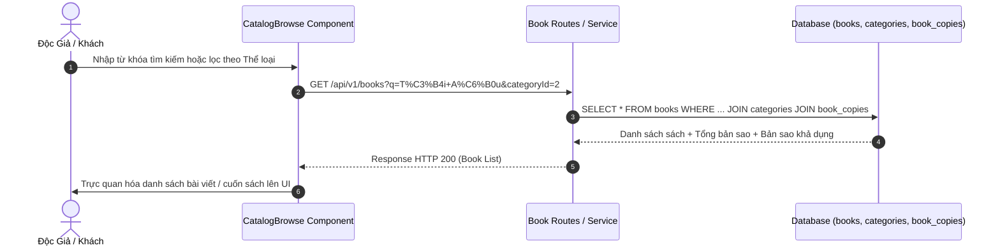

# UC-02: Tra Cứu, Tìm Kiếm & Quản Lý Danh Mục Sách (Book Catalog Management)

## 1. Tổng Quan Use Case
- **Mã Use Case**: UC-02
- **Tên Use Case**: Tra Cứu, Tìm Kiếm & Quản Lý Danh Mục Sách
- **Mô tả ngắn**: Cung cấp khả năng tìm kiếm đa tiêu chí (tên sách, tác giả, ISBN, thể loại), xem chi tiết sách, và thao tác CRUD danh mục sách dành cho Thủ thư/Admin.
- **Tác nhân chính (Actors)**:
  - **Khách / MEMBER**: Tra cứu sách, lọc theo danh mục, xem số lượng bản sao khả dụng.
  - **LIBRARIAN / ADMIN / SUPERADMIN**: Thêm mới sách, chỉnh sửa thông tin sách, cập nhật số lượng bản sao (copies), quản lý thể loại sách.

---

## 2. Các Bảng Cơ Sở Dữ Liệu Sử Dụng (Database Tables Used)

| Tên Bảng (Database Table) | Vai Trò Trong Use Case |
|---|---|
| `books` | Lưu trữ thông tin chung cuốn sách (ISBN, Tên sách, Năm xuất bản, Ảnh bìa, Vị trí). |
| `categories` | Lưu trữ thể loại sách và phân cấp danh mục cha - con. |
| `publishers` | Lưu trữ thông tin nhà xuất bản. |
| `authors` | Lưu trữ thông tin tác giả. |
| `book_authors` | Bảng trung gian n - n liên kết Sách và Tác giả. |
| `book_copies` | Lưu trữ các bản sao vật lý của cuốn sách và trạng thái khả dụng (`AVAILABLE`, `BORROWED`, `MAINTENANCE`). |

---

## 3. Vị Trí Mã Nguồn Chi Tiết (Source Code Line Ranges)

### Backend Logic
- **[book.service.ts - List & Search](file:///Users/admin/library-app/src/modules/catalog/book.service.ts#L7-L105)**: Tìm kiếm đa tiêu chí, JOIN danh mục/tác giả/bản sao và tính toán `availableCopies`.
- **[book.service.ts - Create Book](file:///Users/admin/library-app/src/modules/catalog/book.service.ts#L125-L180)**: Thêm sách mới, kiểm tra trùng ISBN và tự động sinh bản sao vật lý (`book_copies`).
- **[book.service.ts - Update & Delete](file:///Users/admin/library-app/src/modules/catalog/book.service.ts#L185-L260)**: Cập nhật thông tin chi tiết và xóa sách.
- **[book.controller.ts](file:///Users/admin/library-app/src/modules/catalog/book.routes.ts#L10-L45)**: Router định nghĩa các HTTP endpoints tra cứu và quản lý sách.

### Frontend UI Components
- **[CatalogBrowse.tsx](file:///Users/admin/library-app/src/components/CatalogBrowse.tsx#L25-L130)**: Render danh mục dạng lưới, bộ lọc thể loại và thanh tìm kiếm sách.
- **[BookDetailModal.tsx](file:///Users/admin/library-app/src/components/BookDetailModal.tsx#L20-L95)**: Modal xem chi tiết thông tin cuốn sách, tác giả, nhà xuất bản và trạng thái bản sao.

---

## 4. Luồng Sự Kiện Chính (Sequence Diagram)



---

## 5. Câu Lệnh SQL Tương Đương (SQL Queries)

### 1. Truy vấn Danh sách Sách kèm Lọc & Tìm kiếm đa bảng
```sql
SELECT 
  b.id, b.isbn, b.title, b.publication_year, b.cover_image_url, 
  c.name AS category_name, p.name AS publisher_name,
  COUNT(bc.id) AS total_copies,
  COUNT(bc.id) FILTER (WHERE bc.status = 'AVAILABLE') AS available_copies
FROM books b
LEFT JOIN categories c ON b.category_id = c.id
LEFT JOIN publishers p ON b.publisher_id = p.id
LEFT JOIN book_authors ba ON b.id = ba.book_id
LEFT JOIN authors a ON ba.author_id = a.id
LEFT JOIN book_copies bc ON b.id = bc.book_id
WHERE (LOWER(b.title) LIKE '%tối ưu%' OR b.isbn LIKE '%tối ưu%' OR LOWER(a.name) LIKE '%tối ưu%')
GROUP BY b.id, c.name, p.name
ORDER BY b.id DESC
LIMIT 20 OFFSET 0;
```

### 2. Thêm mới bản ghi Sách & Bản sao
```sql
INSERT INTO books (isbn, title, publisher_id, category_id, language, created_at, updated_at)
VALUES ('978-604-56-7890-1', 'Thiết Kế Phân Tán', 1, 2, 'Tiếng Việt', CURRENT_TIMESTAMP, CURRENT_TIMESTAMP)
RETURNING id;

INSERT INTO book_copies (book_id, copy_code, status, created_at)
VALUES (101, 'CP-101-01', 'AVAILABLE', CURRENT_TIMESTAMP);
```

---

## 6. Danh Sách API Liên Quan

| Method | Endpoint | Quyền hạn | Chức năng |
|---|---|---|---|
| `GET` | `/api/v1/books` | Public | Lấy danh sách sách (Phân trang, Lọc, Tìm kiếm) |
| `GET` | `/api/v1/books/:id` | Public | Xem thông tin chi tiết 1 cuốn sách |
| `POST` | `/api/v1/books` | Librarian, Admin, SuperAdmin | Thêm cuốn sách mới vào kho |
| `PUT` | `/api/v1/books/:id` | Librarian, Admin, SuperAdmin | Cập nhật thông tin cuốn sách |
| `DELETE` | `/api/v1/books/:id` | Admin, SuperAdmin | Xóa sách khỏi hệ thống |
