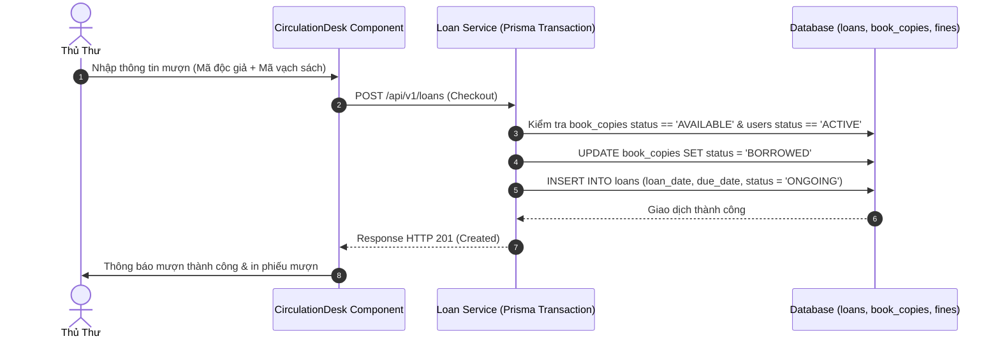

# UC-03: Quản Lý Quy Trình Mượn - Trả & Gia Hạn Sách (Circulation Desk)

## 1. Tổng Quan Use Case
- **Mã Use Case**: UC-03
- **Tên Use Case**: Quản Lý Quy Trình Mượn - Trả & Gia Hạn Sách
- **Mô tả ngắn**: Cung cấp công cụ lưu thông (Circulation Desk) cho Thủ thư thực hiện tạo phiếu mượn sách, ghi nhận trả sách, gia hạn thời gian mượn và tự động tính toán hạn trả.
- **Tác nhân chính (Actors)**:
  - **LIBRARIAN / ADMIN / SUPERADMIN**: Thực hiện tạo phiếu mượn cho độc giả tại quầy, xử lý nhận lại sách và gia hạn.
  - **MEMBER**: Yêu cầu mượn/trả sách, xem danh sách sách đang mượn (`My Loans`).

---

## 2. Các Bảng Cơ Sở Dữ Liệu Sử Dụng (Database Tables Used)

| Tên Bảng (Database Table) | Vai Trò Trong Use Case |
|---|---|
| `loans` | Lưu thông tin phiếu mượn (`member_id`, `book_copy_id`, `loan_date`, `due_date`, `return_date`, `status`). |
| `book_copies` | Cập nhật trạng thái bản sao vật lý từ `AVAILABLE` sang `BORROWED` và ngược lại. |
| `users` | Kiểm tra điều kiện mượn (Trạng thái `ACTIVE`, nợ phạt dưới ngưỡng quy định). |
| `fines` | Tự động sinh bản ghi nợ phạt khi trả sách quá hạn (`return_date > due_date`). |

---

## 3. Vị Trí Mã Nguồn Chi Tiết (Source Code Line Ranges)

### Backend Logic
- **[loan.service.ts - Checkout / Mượn Sách](file:///Users/admin/library-app/src/modules/circulation/loan.service.ts#L25-L105)**: Prisma `$transaction` kiểm tra trạng thái bản sao, kiểm tra nợ phạt độc giả, giảm bản sao khả dụng và tạo phiếu mượn.
- **[loan.service.ts - Return / Trả Sách](file:///Users/admin/library-app/src/modules/circulation/loan.service.ts#L120-L210)**: Xử lý nhận lại sách, tính số ngày quá hạn, tự động sinh phiếu phạt (`Fine`) nếu trễ hạn, và trả trạng thái bản sao về `AVAILABLE`.
- **[loan.service.ts - Renew / Gia Hạn](file:///Users/admin/library-app/src/modules/circulation/loan.service.ts#L220-L280)**: Gia hạn thời gian mượn (+7 ngày) nếu sách không có người đặt trước.
- **[loan.controller.ts](file:///Users/admin/library-app/src/modules/circulation/loan.controller.ts#L10-L50)**: Controller tiếp nhận điều phối luồng HTTP mượn/trả.

### Frontend UI Components
- **[CirculationDesk.tsx](file:///Users/admin/library-app/src/components/CirculationDesk.tsx#L35-L160)**: Giao diện bàn lưu thông tại quầy, cho phép tìm kiếm độc giả, mã vạch cuốn sách và xử lý mượn/trả nhanh.
- **[MyLoans.tsx](file:///Users/admin/library-app/src/components/MyLoans.tsx#L15-L85)**: Giao diện danh sách phiếu mượn cá nhân dành cho Độc giả.

---

## 4. Luồng Sự Kiện Chính (Sequence Diagram)



---

## 5. Câu Lệnh SQL Tương Đương (SQL Queries)

### 1. Kiểm tra Điều kiện Mượn của Độc Giả
```sql
SELECT status FROM users WHERE id = 5;

SELECT COALESCE(SUM(amount), 0) AS total_unpaid 
FROM fines 
WHERE member_id = 5 AND status = 'UNPAID';
```

### 2. Thực thi Giao dịch Mượn Sách (Checkout Transaction)
```sql
BEGIN TRANSACTION;

UPDATE book_copies 
SET status = 'BORROWED' 
WHERE id = 12 AND status = 'AVAILABLE';

INSERT INTO loans (
  book_copy_id, member_id, librarian_id, loan_date, due_date, status, renewal_count
) VALUES (
  12, 5, 2, CURRENT_DATE, CURRENT_DATE + INTERVAL '14 days', 'ONGOING', 0
);

COMMIT;
```

### 3. Trả Sách & Tự động sinh Phiếu phạt nếu Quá Hạn (Return Loan with Overdue Fine)
```sql
BEGIN TRANSACTION;

UPDATE loans 
SET return_date = CURRENT_DATE, 
    status = CASE WHEN CURRENT_DATE > due_date THEN 'OVERDUE_RETURNED' ELSE 'RETURNED' END
WHERE id = 45;

UPDATE book_copies SET status = 'AVAILABLE' WHERE id = 12;

-- Thêm phiếu phạt nếu quá hạn 5 ngày (5.000 VNĐ / ngày = 25.000 VNĐ)
INSERT INTO fines (loan_id, member_id, amount, status, issued_date)
SELECT 45, 5, 25000.00, 'UNPAID', CURRENT_DATE
WHERE CURRENT_DATE > (SELECT due_date FROM loans WHERE id = 45);

COMMIT;
```

---

## 6. Danh Sách API Liên Quan

| Method | Endpoint | Quyền hạn | Chức năng |
|---|---|---|---|
| `POST` | `/api/v1/loans` | Librarian, Admin, SuperAdmin | Tạo phiếu mượn sách mới |
| `GET` | `/api/v1/loans` | Staff (All), Member (Chỉ của mình) | Lấy danh sách phiếu mượn |
| `PATCH` | `/api/v1/loans/:id/return` | Librarian, Admin, SuperAdmin | Xác nhận trả sách & tính tiền phạt |
| `PATCH` | `/api/v1/loans/:id/renew` | Librarian, Admin, SuperAdmin | Gia hạn thời gian mượn sách |
