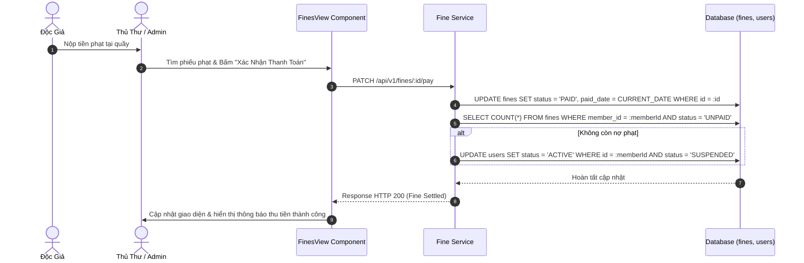

# UC-04: Xử Lý Vi Phạm & Quản Lý Phạt Quá Hạn (Fines & Penalty Management)

## 1. Tổng Quan Use Case
- **Mã Use Case**: UC-04
- **Tên Use Case**: Xử Lý Vi Phạm & Quản Lý Phạt Quá Hạn
- **Mô tả ngắn**: Quản lý các khoản tiền phạt phát sinh do trả sách quá hạn, làm mất hoặc hỏng sách; hỗ trợ thu tiền phạt và tự động cập nhật trạng thái tài khoản độc giả.
- **Tác nhân chính (Actors)**:
  - **LIBRARIAN / ADMIN / SUPERADMIN**: Thu tiền phạt, xác nhận thanh toán (Mark as Paid), miễn giảm phạt (nếu có quyền).
  - **MEMBER**: Xem các khoản phạt cá nhân (`FinesView`) và lịch sử thanh toán.

---

## 2. Các Bảng Cơ Sở Dữ Liệu Sử Dụng (Database Tables Used)

| Tên Bảng (Database Table) | Vai Trò Trong Use Case |
|---|---|
| `fines` | Lưu thông tin tiền phạt (`member_id`, `loan_id`, `amount`, `status` [UNPAID/PAID/WAIVED], `paid_date`, `waived_by_user_id`). |
| `loans` | Liên kết phiếu mượn tương ứng dẫn đến tiền phạt. |
| `users` | Khôi phục trạng thái tài khoản Độc giả từ `SUSPENDED` về `ACTIVE` khi đã thanh toán hết nợ phạt. |

---

## 3. Vị Trí Mã Nguồn Chi Tiết (Source Code Line Ranges)

### Backend Logic
- **[fine.service.ts - List Fines](file:///Users/admin/library-app/src/modules/fine/fine.service.ts#L6-L63)**: Query danh sách phiếu phạt kèm phân trang và lọc theo trạng thái `UNPAID` / `PAID`.
- **[fine.service.ts - Pay Fine](file:///Users/admin/library-app/src/modules/fine/fine.service.ts#L65-L86)**: Xác nhận thu tiền phạt, cập nhật trạng thái phiếu phạt thành `PAID`.
- **[fine.service.ts - Waive Fine](file:///Users/admin/library-app/src/modules/fine/fine.service.ts#L88-L108)**: Miễn giảm tiền phạt dành riêng cho Quản trị viên (`ADMIN` / `SUPERADMIN`).
- **[fine.routes.ts](file:///Users/admin/library-app/src/modules/fine/fine.routes.ts#L10-L35)**: Khai báo các API Endpoints xử lý tiền phạt.

### Frontend UI Components
- **[FinesView.tsx](file:///Users/admin/library-app/src/components/FinesView.tsx#L25-L110)**: Bảng giao diện hiển thị tiền phạt, hỗ trợ nút "Thanh toán" cho Thủ thư và nút "Miễn phạt" cho Admin.

---

## 4. Luồng Sự Kiện Chính (Sequence Diagram)



---

## 5. Câu Lệnh SQL Tương Đương (SQL Queries)

### 1. Truy vấn Danh sách Phiếu phạt chưa nộp
```sql
SELECT 
  f.id, f.amount, f.status, f.issued_date,
  u.full_name AS member_name, u.email AS member_email,
  b.title AS book_title
FROM fines f
JOIN users u ON f.member_id = u.id
LEFT JOIN loans l ON f.loan_id = l.id
LEFT JOIN book_copies bc ON l.book_copy_id = bc.id
LEFT JOIN books b ON bc.book_id = b.id
WHERE f.status = 'UNPAID'
ORDER BY f.issued_date DESC;
```

### 2. Xác nhận Thanh toán Phiếu phạt (Pay Fine)
```sql
UPDATE fines 
SET status = 'PAID', paid_date = CURRENT_DATE 
WHERE id = 15 AND status = 'UNPAID';
```

### 3. Tự động Khôi phục Trạng thái Độc giả khi hết nợ phạt
```sql
UPDATE users 
SET status = 'ACTIVE', updated_at = CURRENT_TIMESTAMP 
WHERE id = 5 
  AND status = 'SUSPENDED' 
  AND NOT EXISTS (
    SELECT 1 FROM fines WHERE member_id = 5 AND status = 'UNPAID'
  );
```

---

## 6. Danh Sách API Liên Quan

| Method | Endpoint | Quyền hạn | Chức năng |
|---|---|---|---|
| `GET` | `/api/v1/fines` | Staff (All), Member (Chỉ phạt cá nhân) | Lấy danh sách phiếu phạt |
| `POST` | `/api/v1/fines` | Librarian, Admin, SuperAdmin | Tạo phiếu phạt thủ công (Mất/hỏng sách) |
| `PATCH` | `/api/v1/fines/:id/pay` | Librarian, Admin, SuperAdmin | Xác nhận thu tiền phạt (Chuyển PAID) |
| `PATCH` | `/api/v1/fines/:id/waive` | Admin, SuperAdmin | Miễn giảm tiền phạt |
