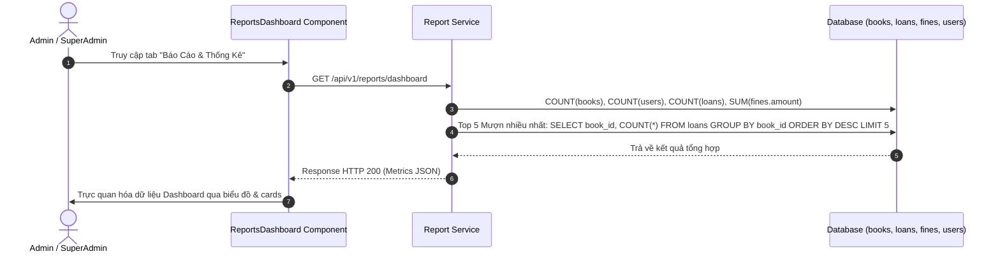

# UC-05: Đặt Trước Sách & Thống Kê Báo Cáo Thư Viện (Reservation & Analytics)

## 1. Tổng Quan Use Case
- **Mã Use Case**: UC-05
- **Tên Use Case**: Đặt Trước Sách & Thống Kê Báo Cáo Thư Viện
- **Mô tả ngắn**: Độc giả có thể đặt giữ chỗ trước cho các cuốn sách đang tạm thời hết bản sao; ban quản lý có thể xem dashboard biểu đồ thống kê tình hình mượn trả, doanh thu tiền phạt và sách phổ biến.
- **Tác nhân chính (Actors)**:
  - **MEMBER**: Đặt giữ chỗ sách đang mượn hết (`availableCopies = 0`), hủy lượt đặt trước.
  - **LIBRARIAN / ADMIN / SUPERADMIN**: Quản lý hàng chờ giữ sách (Hold Queue), xem Báo cáo Thống kê (`ReportsDashboard`).

---

## 2. Các Bảng Cơ Sở Dữ Liệu Sử Dụng (Database Tables Used)

| Tên Bảng (Database Table) | Vai Trò Trong Use Case |
|---|---|
| `reservations` | Lưu danh sách hàng chờ đặt trước sách (`member_id`, `book_id`, `status` [PENDING/COMPLETED/CANCELLED], `reservation_date`). |
| `books` | Lấy thông tin cuốn sách đặt trước. |
| `loans` | Phân tích số lượt mượn trả hàng tháng phục vụ báo cáo. |
| `fines` | Thống kê tổng doanh thu tiền phạt thu được. |
| `users` | Thống kê tổng số lượng độc giả active trong hệ thống. |

---

## 3. Vị Trí Mã Nguồn Chi Tiết (Source Code Line Ranges)

### Backend Logic
- **[reservation.service.ts - Create Reservation](file:///Users/admin/library-app/src/modules/reservation/reservation.service.ts#L15-L75)**: Kiểm tra độc giả đã đặt trước chưa và khởi tạo lượt giữ chỗ `PENDING`.
- **[report.service.ts - Get Dashboard Metrics](file:///Users/admin/library-app/src/modules/report/report.service.ts#L10-L85)**: Tổng hợp các chỉ số KPI: Tổng số sách, Số độc giả active, Lượt mượn trong tháng, Doanh thu tiền phạt và Top 5 sách hot.
- **[report.routes.ts](file:///Users/admin/library-app/src/modules/report/report.routes.ts#L5-L25)**: Endpoints truy xuất dữ liệu thống kê cho Dashboard.

### Frontend UI Components
- **[ReservationsView.tsx](file:///Users/admin/library-app/src/components/ReservationsView.tsx#L15-L80)**: Giao diện quản lý danh sách đặt giữ chỗ sách.
- **[ReportsDashboard.tsx](file:///Users/admin/library-app/src/components/ReportsDashboard.tsx#L20-L140)**: Giao diện Dashboard trực quan hóa các widget chỉ số và biểu đồ thống kê.

---

## 4. Luồng Sự Kiện Chính (Sequence Diagram)



---

## 5. Câu Lệnh SQL Tương Đương (SQL Queries)

### 1. Thêm lượt Đặt trước Sách (Create Reservation)
```sql
INSERT INTO reservations (book_id, member_id, status, reservation_date, created_at)
VALUES (101, 5, 'PENDING', CURRENT_DATE, CURRENT_TIMESTAMP)
RETURNING id;
```

### 2. Thống kê Chỉ số KPI Tổng quan Dashboard
```sql
SELECT 
  (SELECT COUNT(*) FROM books) AS total_books,
  (SELECT COUNT(*) FROM users WHERE status = 'ACTIVE' AND role = 'MEMBER') AS total_active_members,
  (SELECT COUNT(*) FROM loans WHERE loan_date >= DATE_TRUNC('month', CURRENT_DATE)) AS monthly_loans,
  (SELECT COALESCE(SUM(amount), 0) FROM fines WHERE status = 'PAID') AS total_fine_revenue;
```

### 3. Thống kê Top 5 Cuốn sách mượn nhiều nhất (Top 5 Borrowed Books)
```sql
SELECT 
  b.id, b.title, b.isbn, COUNT(l.id) AS borrow_count
FROM loans l
JOIN book_copies bc ON l.book_copy_id = bc.id
JOIN books b ON bc.book_id = b.id
GROUP BY b.id, b.title, b.isbn
ORDER BY borrow_count DESC
LIMIT 5;
```

---

## 6. Danh Sách API Liên Quan

| Method | Endpoint | Quyền hạn | Chức năng |
|---|---|---|---|
| `POST` | `/api/v1/reservations` | Member, Staff | Đặt giữ chỗ sách |
| `GET` | `/api/v1/reservations` | Staff (All), Member (Cá nhân) | Danh sách yêu cầu đặt sách |
| `PATCH` | `/api/v1/reservations/:id/cancel` | Member, Staff | Hủy yêu cầu đặt chỗ |
| `GET` | `/api/v1/reports/dashboard` | Admin, SuperAdmin, Librarian | Lấy chỉ số thống kê & báo cáo tổng quan |
