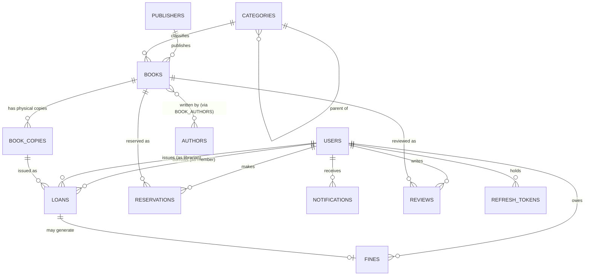

# 3. Database Design

## 3.1 Entity-Relationship Diagram



## 3.2 Full DDL (MySQL 8.0, InnoDB, utf8mb4)

```sql
CREATE TABLE users (
    id BIGINT AUTO_INCREMENT PRIMARY KEY,
    full_name VARCHAR(150) NOT NULL,
    email VARCHAR(150) NOT NULL UNIQUE,
    password_hash VARCHAR(255) NOT NULL,
    phone VARCHAR(20),
    address VARCHAR(255),
    role ENUM('ADMIN','LIBRARIAN','MEMBER') NOT NULL DEFAULT 'MEMBER',
    status ENUM('ACTIVE','SUSPENDED','INACTIVE') NOT NULL DEFAULT 'ACTIVE',
    membership_expiry_date DATE,
    created_at TIMESTAMP DEFAULT CURRENT_TIMESTAMP,
    updated_at TIMESTAMP DEFAULT CURRENT_TIMESTAMP ON UPDATE CURRENT_TIMESTAMP,
    INDEX idx_users_role (role)
) ENGINE=InnoDB DEFAULT CHARSET=utf8mb4;

CREATE TABLE refresh_tokens (
    id BIGINT AUTO_INCREMENT PRIMARY KEY,
    user_id BIGINT NOT NULL,
    token VARCHAR(512) NOT NULL UNIQUE,
    expiry_date TIMESTAMP NOT NULL,
    created_at TIMESTAMP DEFAULT CURRENT_TIMESTAMP,
    CONSTRAINT fk_refresh_user FOREIGN KEY (user_id) REFERENCES users(id) ON DELETE CASCADE
) ENGINE=InnoDB DEFAULT CHARSET=utf8mb4;

CREATE TABLE publishers (
    id BIGINT AUTO_INCREMENT PRIMARY KEY,
    name VARCHAR(150) NOT NULL,
    address VARCHAR(255),
    website VARCHAR(255),
    created_at TIMESTAMP DEFAULT CURRENT_TIMESTAMP
) ENGINE=InnoDB DEFAULT CHARSET=utf8mb4;

CREATE TABLE categories (
    id BIGINT AUTO_INCREMENT PRIMARY KEY,
    name VARCHAR(100) NOT NULL UNIQUE,
    description VARCHAR(255),
    parent_category_id BIGINT NULL,
    CONSTRAINT fk_category_parent FOREIGN KEY (parent_category_id) REFERENCES categories(id) ON DELETE SET NULL
) ENGINE=InnoDB DEFAULT CHARSET=utf8mb4;

CREATE TABLE authors (
    id BIGINT AUTO_INCREMENT PRIMARY KEY,
    name VARCHAR(150) NOT NULL,
    biography TEXT,
    birth_date DATE,
    nationality VARCHAR(100),
    created_at TIMESTAMP DEFAULT CURRENT_TIMESTAMP
) ENGINE=InnoDB DEFAULT CHARSET=utf8mb4;

CREATE TABLE books (
    id BIGINT AUTO_INCREMENT PRIMARY KEY,
    isbn VARCHAR(20) NOT NULL UNIQUE,
    title VARCHAR(255) NOT NULL,
    subtitle VARCHAR(255),
    publisher_id BIGINT,
    category_id BIGINT,
    language VARCHAR(50) DEFAULT 'Vietnamese',
    edition VARCHAR(50),
    publication_year YEAR,
    page_count INT,
    description TEXT,
    cover_image_url VARCHAR(500),
    created_at TIMESTAMP DEFAULT CURRENT_TIMESTAMP,
    updated_at TIMESTAMP DEFAULT CURRENT_TIMESTAMP ON UPDATE CURRENT_TIMESTAMP,
    CONSTRAINT fk_book_publisher FOREIGN KEY (publisher_id) REFERENCES publishers(id) ON DELETE SET NULL,
    CONSTRAINT fk_book_category FOREIGN KEY (category_id) REFERENCES categories(id) ON DELETE SET NULL,
    FULLTEXT INDEX idx_books_title (title)
) ENGINE=InnoDB DEFAULT CHARSET=utf8mb4;

CREATE TABLE book_authors (
    book_id BIGINT NOT NULL,
    author_id BIGINT NOT NULL,
    PRIMARY KEY (book_id, author_id),
    CONSTRAINT fk_ba_book FOREIGN KEY (book_id) REFERENCES books(id) ON DELETE CASCADE,
    CONSTRAINT fk_ba_author FOREIGN KEY (author_id) REFERENCES authors(id) ON DELETE CASCADE
) ENGINE=InnoDB DEFAULT CHARSET=utf8mb4;

CREATE TABLE book_copies (
    id BIGINT AUTO_INCREMENT PRIMARY KEY,
    book_id BIGINT NOT NULL,
    copy_code VARCHAR(50) NOT NULL UNIQUE,
    status ENUM('AVAILABLE','BORROWED','RESERVED','LOST','DAMAGED','WITHDRAWN') NOT NULL DEFAULT 'AVAILABLE',
    shelf_location VARCHAR(50),
    acquisition_date DATE,
    created_at TIMESTAMP DEFAULT CURRENT_TIMESTAMP,
    updated_at TIMESTAMP DEFAULT CURRENT_TIMESTAMP ON UPDATE CURRENT_TIMESTAMP,
    CONSTRAINT fk_copy_book FOREIGN KEY (book_id) REFERENCES books(id) ON DELETE CASCADE,
    INDEX idx_copies_status (status),
    INDEX idx_copies_book (book_id)
) ENGINE=InnoDB DEFAULT CHARSET=utf8mb4;

CREATE TABLE loans (
    id BIGINT AUTO_INCREMENT PRIMARY KEY,
    book_copy_id BIGINT NOT NULL,
    member_id BIGINT NOT NULL,
    librarian_id BIGINT NOT NULL,
    loan_date DATE NOT NULL,
    due_date DATE NOT NULL,
    return_date DATE NULL,
    status ENUM('ONGOING','RETURNED','OVERDUE','LOST') NOT NULL DEFAULT 'ONGOING',
    renewal_count INT NOT NULL DEFAULT 0,
    created_at TIMESTAMP DEFAULT CURRENT_TIMESTAMP,
    updated_at TIMESTAMP DEFAULT CURRENT_TIMESTAMP ON UPDATE CURRENT_TIMESTAMP,
    CONSTRAINT fk_loan_copy FOREIGN KEY (book_copy_id) REFERENCES book_copies(id),
    CONSTRAINT fk_loan_member FOREIGN KEY (member_id) REFERENCES users(id),
    CONSTRAINT fk_loan_librarian FOREIGN KEY (librarian_id) REFERENCES users(id),
    INDEX idx_loans_status (status),
    INDEX idx_loans_member (member_id),
    INDEX idx_loans_due_date (due_date)
) ENGINE=InnoDB DEFAULT CHARSET=utf8mb4;

CREATE TABLE reservations (
    id BIGINT AUTO_INCREMENT PRIMARY KEY,
    book_id BIGINT NOT NULL,
    member_id BIGINT NOT NULL,
    reservation_date TIMESTAMP DEFAULT CURRENT_TIMESTAMP,
    status ENUM('PENDING','READY','FULFILLED','CANCELLED','EXPIRED') NOT NULL DEFAULT 'PENDING',
    queue_position INT NOT NULL,
    expiry_date DATE,
    CONSTRAINT fk_res_book FOREIGN KEY (book_id) REFERENCES books(id),
    CONSTRAINT fk_res_member FOREIGN KEY (member_id) REFERENCES users(id),
    INDEX idx_res_status (status),
    INDEX idx_res_book (book_id)
) ENGINE=InnoDB DEFAULT CHARSET=utf8mb4;

CREATE TABLE fines (
    id BIGINT AUTO_INCREMENT PRIMARY KEY,
    loan_id BIGINT NOT NULL,
    member_id BIGINT NOT NULL,
    amount DECIMAL(10,2) NOT NULL,
    reason ENUM('LATE_RETURN','LOST_BOOK','DAMAGED_BOOK') NOT NULL,
    status ENUM('UNPAID','PAID','WAIVED') NOT NULL DEFAULT 'UNPAID',
    issued_date DATE NOT NULL,
    paid_date DATE NULL,
    waived_by BIGINT NULL,
    CONSTRAINT fk_fine_loan FOREIGN KEY (loan_id) REFERENCES loans(id),
    CONSTRAINT fk_fine_member FOREIGN KEY (member_id) REFERENCES users(id),
    CONSTRAINT fk_fine_waived_by FOREIGN KEY (waived_by) REFERENCES users(id),
    INDEX idx_fines_status (status),
    INDEX idx_fines_member (member_id)
) ENGINE=InnoDB DEFAULT CHARSET=utf8mb4;

CREATE TABLE notifications (
    id BIGINT AUTO_INCREMENT PRIMARY KEY,
    user_id BIGINT NOT NULL,
    type ENUM('DUE_SOON','OVERDUE','RESERVATION_READY','FINE_ISSUED') NOT NULL,
    message VARCHAR(500) NOT NULL,
    is_read BOOLEAN NOT NULL DEFAULT FALSE,
    created_at TIMESTAMP DEFAULT CURRENT_TIMESTAMP,
    CONSTRAINT fk_notif_user FOREIGN KEY (user_id) REFERENCES users(id) ON DELETE CASCADE,
    INDEX idx_notif_user_unread (user_id, is_read)
) ENGINE=InnoDB DEFAULT CHARSET=utf8mb4;

CREATE TABLE reviews (
    id BIGINT AUTO_INCREMENT PRIMARY KEY,
    book_id BIGINT NOT NULL,
    member_id BIGINT NOT NULL,
    rating TINYINT NOT NULL,
    comment TEXT,
    created_at TIMESTAMP DEFAULT CURRENT_TIMESTAMP,
    CONSTRAINT fk_review_book FOREIGN KEY (book_id) REFERENCES books(id) ON DELETE CASCADE,
    CONSTRAINT fk_review_member FOREIGN KEY (member_id) REFERENCES users(id) ON DELETE CASCADE,
    CONSTRAINT chk_rating CHECK (rating BETWEEN 1 AND 5),
    UNIQUE KEY uq_review_book_member (book_id, member_id)
) ENGINE=InnoDB DEFAULT CHARSET=utf8mb4;
```
